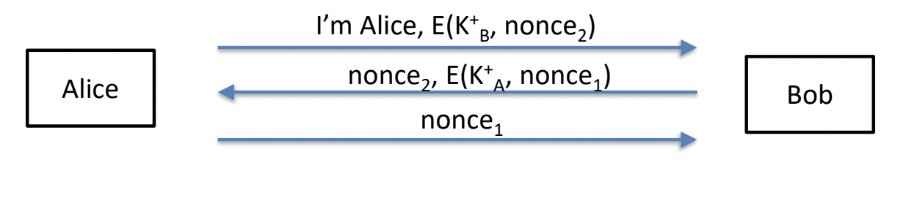

# Part 1: Written Questions
> Valentin Huber, vhuber

## 1.1 *PayMe!*

### 1.1.a Nonce

A nonce is a randomly generated number that is used to distinguish requests from each other. The server will only accept each nonce once which means just replaying the same message again will not transfer the money again.

### 1.1.b Exploit

If an attacker can either catch Alice's package and prevent it from reaching the server or at least can delay it for long enough that they may send a package that arrives at the server before the original, they can do the following:

- Change `X` to include the first `k` bits of `n`
- Change `n` to not include those bits

The signature is still valid, but the amount has changed. So if the attacker can convince Alice to send them some money, they can increase that amount without Alice's involvement.

## 1.2 *PompousPass*

### 1.2.a Attacks

- The server is not authenticated. This means an attacker can pretend to be the server and get a user to authenticate with them. At this point, the attacker has all necessary information to authenticate as the user to the actual server.
  - This also works if the attacker can just delay the users message long enough that they can send the exact same message from their machine.
- The protocol doesn't describe whether or not the signed data is hashed before the signature. Both options have unwanted consequences because an attacker can decrypt the signature content using the user's public key:
  - If it isn't hashed, the attacker instantly gets to know the user's password. 
  - If it is hashed, the attacker can guess the user's password offline by repeatedly hashing the current guess (including the prefix and suffix) and comparing the result to the decrypted hash.
  - Either way, an attacker could then get the user to sign something beginning with the Id/Pw combination, they could package the rest of the message as the nonce and authenticate to the server.
  - Also: Chances are that at least some users will reuse passwords for other websites, so getting valid passwords for a person is an issue regardless of whether or not we can actually attack the system.

### 1.2.b Defense

- The protocol doesn't really need passwords, since control of the private key should be enough to authenticate the user. So you could just get rid of it without loosing anything.
- I would also add some sort of server authentication, maybe like this (taken from the authentication protocol slides). This basically just adds a public/private keypair for the server and checks it in the client. It also makes sure the nonce signed by the client is provided by the server which means an attacker would at least have to intercept both messages to craft something malicious.

### 1.2.c Session keys

Because symmetric cryptographic cyphers are usually significantly faster.

## 1.3 *Kerberos-ish*

### 1.3.a Client Authentication

To the KDC: yes. The client is the only one who could decrypt the second message, which would allow them to communicate with the service, because one needs both the temporary key and the ticket for that.

To the service: yes, since the true client is the only one who would have the temporary key to encrypt the second part and the ticket, which is encrypted by a secret key (to anyone but the KDC and the service) and contains the temporary key the service would use to check wether or not the client's claimed ID and the ID in the ticket match.

### 1.3.b Server Authentication

To the KDC: no, at least not immediately visible to the client. A person-in-the-middle attacker could reply to the initial request by the client with random data, which the client would decrypt. They would only notice, if the lifetime is invalid (like a timestamp in the past). The client cannot decrypt the part of the returned value that contains the ID. The client would however notice the deception once they interact with the service, because the service would not allow the connection since the by them decrypted ticket contains ID data that doesn't match with what the client sent in the part of the message that is encrypted using the temporary key.

To the service: yes, since the server is the only party that can decrypt the ticket and get the temporary key. The server proves his identity by encrypting a number known to the client with a key only the server could know.

### 1.3.c Not achieved goal

The client needs to access its key for every new connection to a service. This means the key is either decrypted somewhere on the client's computer (which is bad since somebody might be able to steal it) or the client needs to authorize it every time by entering a password (Kerberos was created exactly to prevent this necessity).